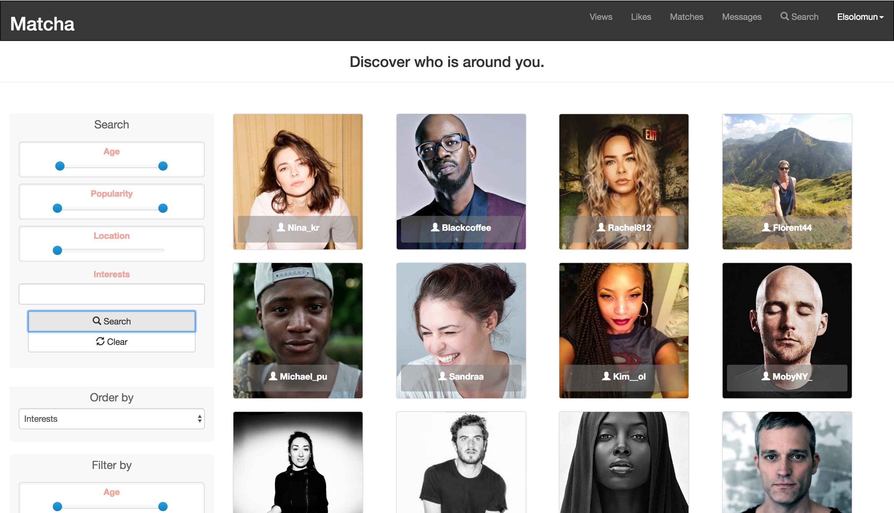
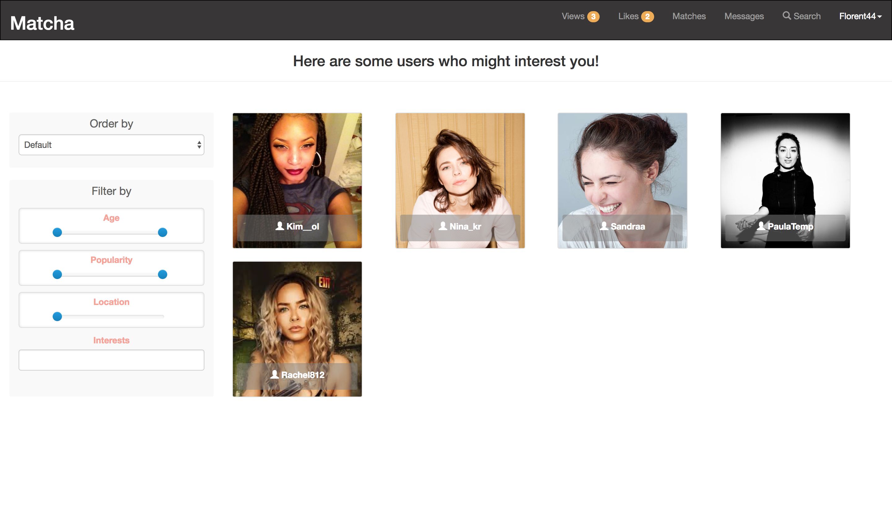
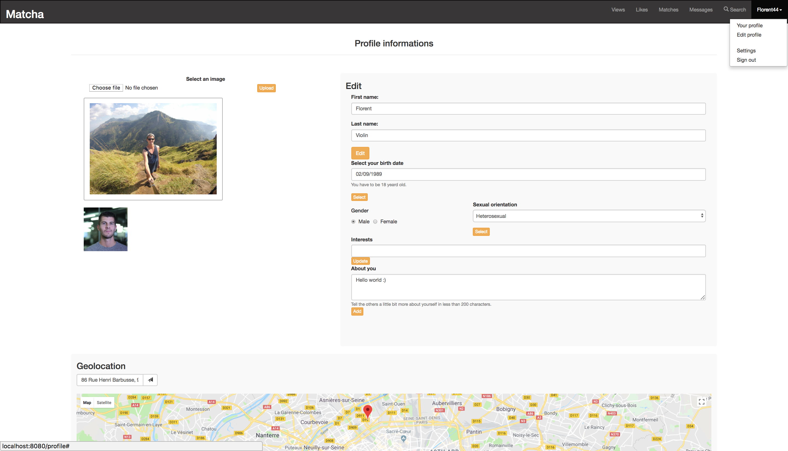
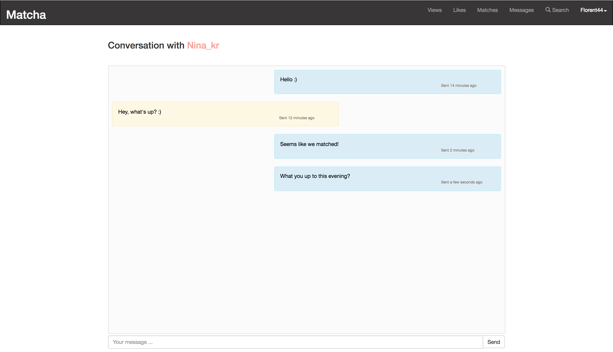

# 42-matcha

Ecole 42 Paris solo project

## NodeJS + ReactJS/Redux isomorphic application

Matcha is a dating web application based on geolocation and matching between users.

## Application anatomy

### Back-end server

- ./app/back
    - ./assets
	- ./config
		- config.js
		- routes.js
    - ./controllers
    - ./models
    - ./policies
    - ./repository
    - ./server
    - ./services
    - ./uploads
	- index.js
	- package.json

### Front-end server

- ./app/front
	- ./actions
        - ./Auth
        - ./Tags
        - ./User
	- ./components
        - ./Auth
        - ./User
	- ./config
        - config.js
	- ./containers
        - routes.js
    - ./helpers
	- ./reducers
        - Auth
        - Tags
        - User
    - ./style
	- index.html
	- index.js
	- package.json
    - webpack.config.js

## Set up

```sh

# Brew version
➜ brew update

# Install NodeJS + MongoDB
➜ brew install node mongo

# Install all modules and start client server
➜ sh script/install.sh

# Start mongo server
➜ mongod
or
➜ mongod -dbpath ~/data/db

# Start backend server
➜ cd app/back
➜ yarn start-server

# Set Matcha db + all collections
➜ localhost:3000/api/setcollections

# Access to application client from navigator
➜ localhost:8080

```

## UI snippets

Discovering Page:



Recommendation Page:



Edit Profile Page:



Messaging Page:



For more pictures about the application UI go to the screenshots folder.